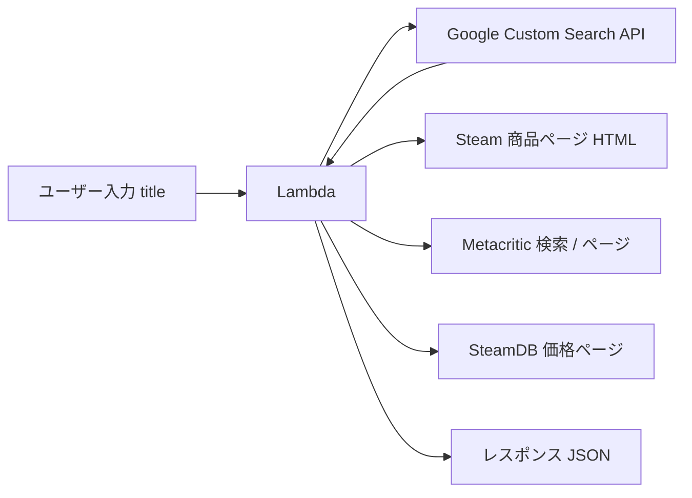
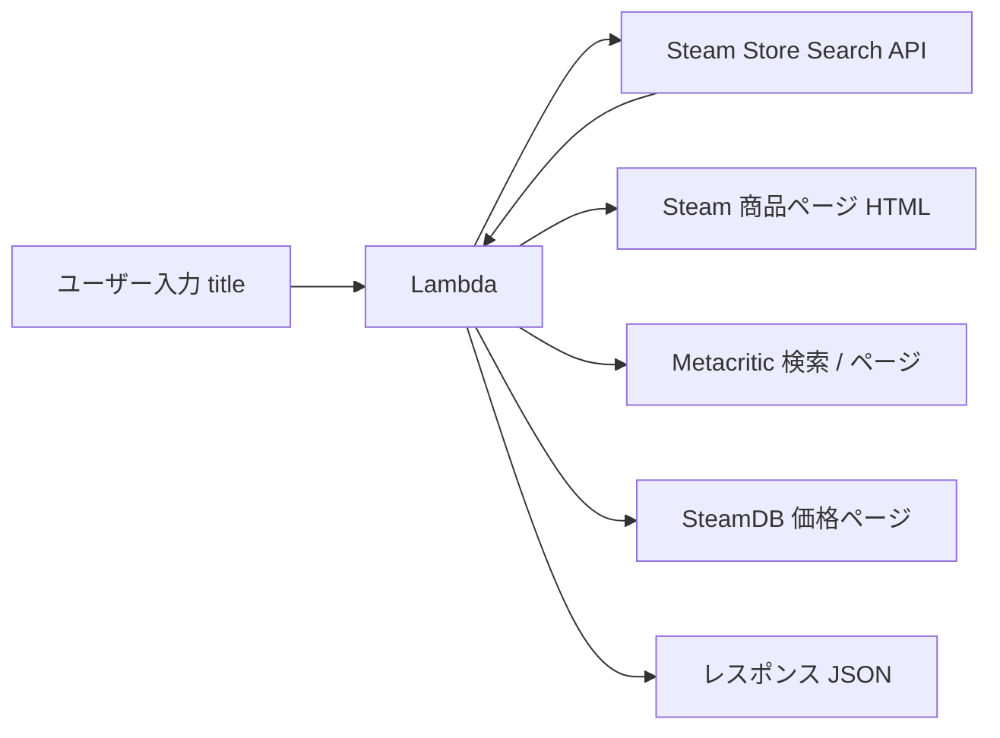

# Google Custom Search JSON API から Steam Store Search API への移行

## 目的

`steamGame` / `steamGameTest` Lambda 関数が Steam 商品ページの URL を特定するために利用していた Google Custom Search JSON API を、Steam 公式の Store Search API に置き換える。

## 背景・経緯

### 発生した障害

`https://apil1.semnil.com/steamGame?title=...` が HTTP 403 を返し、機能不能状態となった。Lambda 側のレスポンス本文は以下:

```json
{
  "error": "Can not open a steam page.",
  "search_result": {
    "error": {
      "code": 403,
      "message": "This project does not have the access to Custom Search JSON API.",
      "status": "PERMISSION_DENIED"
    }
  }
}
```

### 調査プロセスと判明した事実

| 実施した確認 | 結果 |
|---|---|
| Google Cloud プロジェクト `teikoku-tool` で Custom Search API が有効か | 有効 |
| API キーが無効化されていないか | 有効 |
| API キーに API 制限がかかっていないか | 制限なし (後に Custom Search API 限定に変更) |
| Programmable Search Engine (cx) が存在するか | 存在する (cx=`014066456404057816254:1wzh5t2n5cy`) |
| Lambda が参照していた cx と現行 cx の一致 | **不一致** (Lambda は古い `013485343864242843670:2hl_4kgc9oy` を参照) |
| 両 cx での API 呼び出し結果 | どちらも同じ 403 |
| 新規 API キーを発行して試行 | 同じ 403 |
| API を無効化 → 再有効化 | 同じ 403 |
| プロジェクトへの課金アカウントリンク | リンク後も 403 |

cx・キー・API 有効化・課金すべての切り分けで 403 が再現するため、**プロジェクト単位で Custom Search JSON API へのアクセスが拒否されている** と判断した。

### 根本原因

Google 公式の [Custom Search JSON API 概要ページ](https://developers.google.com/custom-search/v1/overview?hl=ja) に以下の告知がある:

> 注: カスタム検索 JSON API は、新規のお客様にはご利用いただけません。Vertex AI Search は、最大 50 個のドメインを検索する場合に最適な代替手段です。または、ウェブ全体を検索する必要があるユースケースについては、こちらからウェブ全体を検索するソリューションについてお問い合わせください。
> 既存の Custom Search JSON API のお客様は、2027 年 1 月 1 日までに代替ソリューションに移行する必要があります。

本プロジェクトは 2017 年から稼働していたが、近年は呼び出し頻度が低く、課金アカウントも未リンク状態であった。この条件が重なり、Google 側で「新規顧客」相当と再分類され、API アクセスがサイレントに遮断されたと推定される。同様の事象は Stack Overflow 等でも複数報告されており、課金アクティブ化や API 再有効化では復旧しないケースが多い。

2027/01/01 以降は全顧客で利用不能になるため、いずれにせよ移行は必須である。

## 代替案の比較

| 案 | コスト | 実装量 | 本ユースケースへの適合度 |
|---|---|---|---|
| **A. Steam Store Search API** (公式) | 無料 | 小 | 最適 |
| B. Vertex AI Search | 有料 (クエリ課金) | 大 | オーバースペック |
| C. Bing Web Search API (Azure) | 有料 | 中 | 置換可能 |
| D. SearXNG セルフホスト | インフラ代 | 大 | 個人用には過剰 |

既存の用途は「ユーザーが入力したタイトル文字列から Steam 商品ページの app_id を特定する」ことのみであり、Steam 自体が提供している検索 API (案 A) が最小変更で最も素直な置換先となる。

## 採用する設計: Steam Store Search API

### エンドポイント

```
GET https://store.steampowered.com/api/storesearch/?term={QUERY}&l=japanese&cc=jp
```

- 認証不要 (API キー不要)
- JSON レスポンス
- 英語タイトル・日本語タイトルのどちらでも検索可能

### レスポンス例

```json
{
  "total": 10,
  "items": [
    {
      "type": "app",
      "name": "Portal 2",
      "id": 620,
      "price": { "currency": "JPY", "initial": 120000, "final": 120000 },
      "metascore": "95",
      "platforms": { "windows": true, "mac": false, "linux": true }
    }
  ]
}
```

先頭の `items[0].id` を取得し、`https://store.steampowered.com/app/${id}/` を組み立てるだけで商品ページ URL が確定する。

### データフロー比較

#### 変更前



#### 変更後



## 実装計画

> 実装は 2026-04-18 に完了し、ローカル動作確認も通過済み。以下は差分と設計意図の記録。残タスクは CodeBuild 経由でのデプロイと、`kms:Decrypt` 権限の剥離 (別 PR)。

### 対象ファイル

- [lambda/steamGame/info_json.sh](../lambda/steamGame/info_json.sh)
- [lambda/steamGame/lambda_function.py](../lambda/steamGame/lambda_function.py)
- [lambda/steamGameTest/info_json.sh](../lambda/steamGameTest/info_json.sh)
- [lambda/steamGameTest/lambda_function.py](../lambda/steamGameTest/lambda_function.py)
- [lambda/sam-base.yaml](../lambda/sam-base.yaml)
- [lambda/build.sh](../lambda/build.sh)
- [lambda/.env.base](../lambda/.env.base) (サンプル)

### info_json.sh の変更点

現行の [lambda/steamGame/info_json.sh:51-57](../lambda/steamGame/info_json.sh#L51-L57) の Google Custom Search ブロックを Steam Store Search API 呼び出しに差し替える。

**変更前 (該当ブロック):**
```bash
QUERY=`echo ${INPUT_STR} | sed 's/-/ /g' | sed 's/　/ /g' | sed 's/ /+/g' | sed 's/:/%3A/g' | sed 's/&/%26/g' | sed 's/!/\\!/g' | sed 's/%20/+/g'`
SEARCH_URL="${GOOGLE_SEARCH_STR}${QUERY}"
curl "${SEARCH_URL}" > ${TMP_PAGE_FILE}
STEAM_LINK=`cat ${TMP_PAGE_FILE} | grep "\"link\":" | grep 'https:\/\/store.steampowered.com\/app\/[0-9]\+' | head -n 1 | sed 's/^.*\"link\": //g' | sed 's/,.*//g' | sed 's/?.*"$/"/g'`
```

**変更後 (該当ブロック):**
```bash
QUERY=`python -c "import sys,urllib.parse; print(urllib.parse.quote(sys.argv[1]))" "${INPUT_STR}"`
SEARCH_URL="${STEAM_SEARCH_STR}${QUERY}"
curl -sS "${SEARCH_URL}" > ${TMP_PAGE_FILE}
APP_ID=`python -c "import sys,json; d=json.load(sys.stdin); print(d['items'][0]['id'] if d.get('items') else '')" < ${TMP_PAGE_FILE}`
if [ -z "${APP_ID}" ] ; then
    echo "{\"error\":\"No steam app matched the query.\"}"
    exit 0
fi
STEAM_LINK="\"https://store.steampowered.com/app/${APP_ID}/\""
```

合わせてファイル冒頭の `GOOGLE_SEARCH_STR` 定義を `STEAM_SEARCH_STR="https://store.steampowered.com/api/storesearch/?l=japanese&cc=jp&term="` に差し替える。`GOOGLE_API_KEY` / `GOOGLE_APP_ID` の参照と、Google 用の `QUERY` 加工 (`sed` チェーン) は削除。

Steam 商品ページ取得直後にあった `"domain": "usageLimits"` 判定ブロック (Google 固有エラー) も削除する。

Metacritic 検索の fallback ([info_json.sh:169](../lambda/steamGame/info_json.sh#L169) 付近) は `QUERY` 変数を参照しているが、新実装の `QUERY` は `urllib.parse.quote` によるエンコード済み文字列で、Metacritic URL に埋め込んでも支障ない。そのため既存ロジックをそのまま流用する (追加の `META_QUERY` は不要)。

### lambda_function.py の変更点

[lambda/steamGame/lambda_function.py:21-27](../lambda/steamGame/lambda_function.py#L21-L27) の KMS 復号処理を削除する。Google 関連の環境変数はすべて不要になる。

**変更前:**
```python
ENCRYPTED = os.environ['ENCRYPTED_GOOGLE_API_KEY']
os.environ['GOOGLE_API_KEY'] = boto3.client('kms').decrypt(CiphertextBlob=b64decode(ENCRYPTED))['Plaintext'].decode('utf-8')
ENCRYPTED = os.environ['ENCRYPTED_GOOGLE_APP_ID']
os.environ['GOOGLE_APP_ID'] = os.environ['GOOGLE_SEARCH_KEY']
```

**変更後:** 削除。

`from base64 import b64decode` も不要になるため削除する。`boto3.client('kms')` の呼び出しが他になければ KMS 関連 import も整理する。

### sam-base.yaml の変更点

[lambda/sam-base.yaml:99-110](../lambda/sam-base.yaml#L99-L110) の `steamGame` / `steamGameTest` セクションから以下を削除:

- 環境変数 `ENCRYPTED_GOOGLE_API_KEY`
- 環境変数 `ENCRYPTED_GOOGLE_APP_ID`
- 環境変数 `GOOGLE_SEARCH_KEY`
- `KmsKeyArn` プロパティ

`IS_LAMBDA: 'true'` と `TABLE_NAME` は保持する。

### build.sh の変更点

[lambda/build.sh:7](../lambda/build.sh#L7) の `sed` パイプラインから以下の置換を削除:

- `encrypted_google_api_key_placeholder`
- `encrypted_google_app_id_placeholder`
- `google_search_key_placeholder`
- `kms_key_arn_placeholder`

### .env.base の変更点

`ENCRYPTED_GOOGLE_API_KEY`, `ENCRYPTED_GOOGLE_APP_ID`, `KMS_KEY_ARN`, `GOOGLE_SEARCH_KEY` の 4 つの `export` 行を削除。CodeBuild の環境変数からも併せて外すこと。

### IAM ロールの確認

既存 Lambda 実行ロールに `kms:Decrypt` 権限が付与されている場合、Google 関連削除後は不要になる。ただしロール自体は DynamoDB 等でも使用しているため、不要な権限のみを剥がす。別 PR でのクリーンアップでもよい。

## 影響範囲とリスク

### 機能面

- Google が拾ってくれていた「タイポや表記揺れに対する柔軟マッチ」は若干低下する可能性がある
  - 例: `"porrtal"` (タイポ) → Google は "Did you mean" 的に Portal を返すが、Steam 検索では 0 件の可能性
  - 対策が必要な場合は Levenshtein 距離等でフロント側のサジェストを検討する
- Metacritic の検索フローは従来通り維持

### 運用面

- Google Cloud プロジェクトの課金リスクが消える
- KMS キーの管理負担が消える
- API キーローテーションの手間が消える

### レート制限

- Steam Store Search API には公式のレート制限文書がない
- 実運用での挙動として 1 秒あたり数リクエスト程度は問題ないことが多い
- 現行プロジェクトはユーザー数が限定的であり、問題になる可能性は低い
- 心配な場合は DynamoDB キャッシュ (既存の `histories` テーブル) を優先利用するロジックを維持

## 動作確認計画

### ローカル確認結果 (2026-04-18 実施)

macOS (Python 3.14, curl) にて `IS_LAMBDA=true` + `python` シンボリックリンク (`python` → `python3`) を用意して実施。すべて期待どおりの挙動。

| 入力 | 結果 |
|---|---|
| `portal` | Portal 2 (app/620) |
| `half-life` | Half-Life (app/70) |
| `ファイナルファンタジー` (URL エンコード済み) | FFXIII (app/292120) |
| `https://store.steampowered.com/app/620/` | そのまま通過し Portal 2 を取得 |
| `620` (app_id) | Portal 2 (app/620) |
| `zzz_nonexistent_game_xxx` | `{"error":"No steam app matched the query."}` |

> 注: ローカル Lambda 環境以外では `python` コマンドが無いことが多いため、本スクリプトは Lambda 側での実行を前提とする。macOS でローカル検証する場合は `ln -sf $(which python3) /tmp/pyshim/python && export PATH=/tmp/pyshim:$PATH` のような一時シンボリックリンクで回避する。

### デプロイ後の確認項目

1. CodeBuild で `lambda/build.sh` を走らせて SAM パッケージングに成功することを確認
2. `steamGameTest` 経由で代表的なタイトルの挙動を確認
3. `https://apil1.semnil.com/steamGame?title=portal&cache=no` が 200 を返すことを確認
4. DynamoDB のキャッシュ (`cache=yes` デフォルト) が機能することを確認

### 回帰確認

- 既存のフロントエンド ([js/search.js](../js/search.js), [js/hist.js](../js/hist.js)) のレスポンス形式互換性を確認
- レスポンス JSON のキー (title, steam_url, date, genre, metascore, metacritics_url, reviews, price, steamdb_url, developer, developer_url) はすべて維持

## 参考リンク

- [Custom Search JSON API 公式ドキュメント (段階的廃止告知)](https://developers.google.com/custom-search/v1/overview?hl=ja)
- [Vertex AI Search (移行候補)](https://cloud.google.com/enterprise-search)
- [Steam Store Search API 非公式解説](https://steamapi.xpaw.me/)
